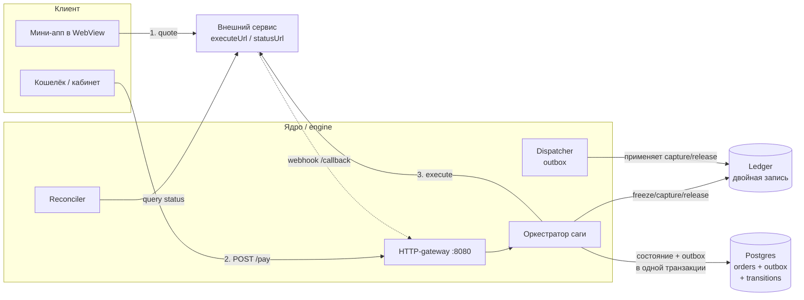
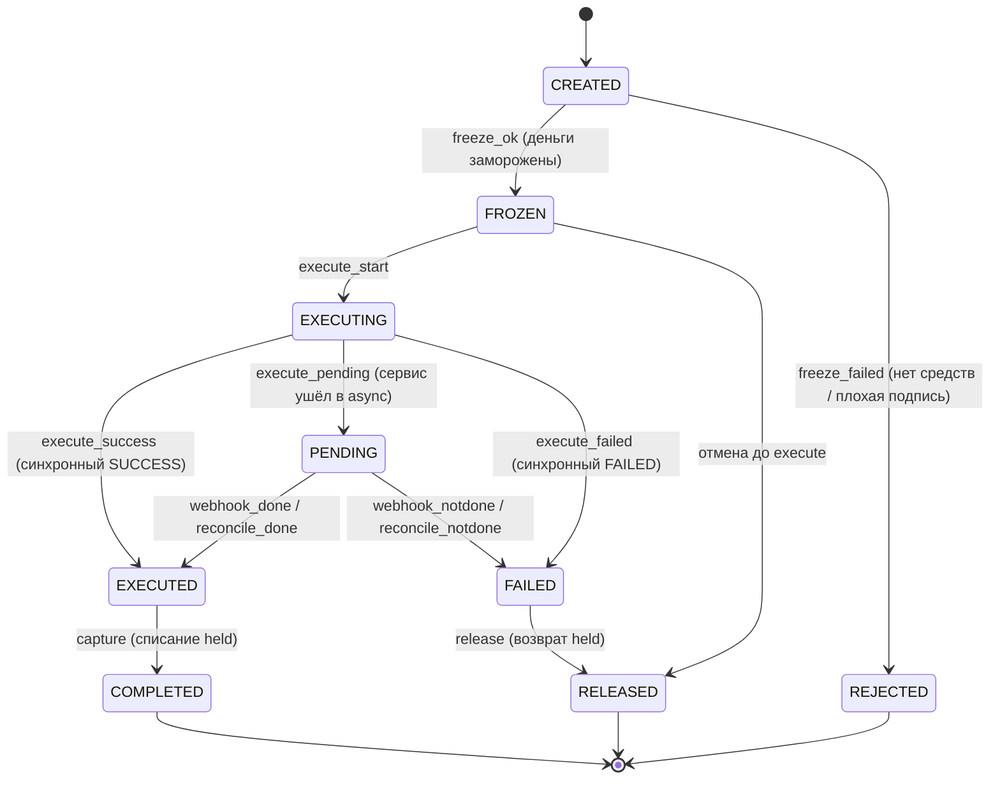
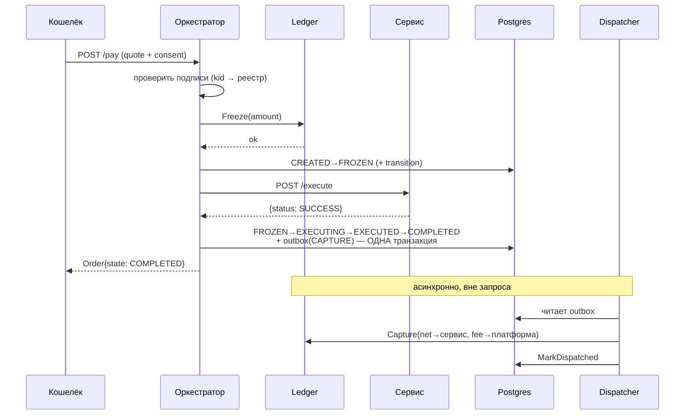
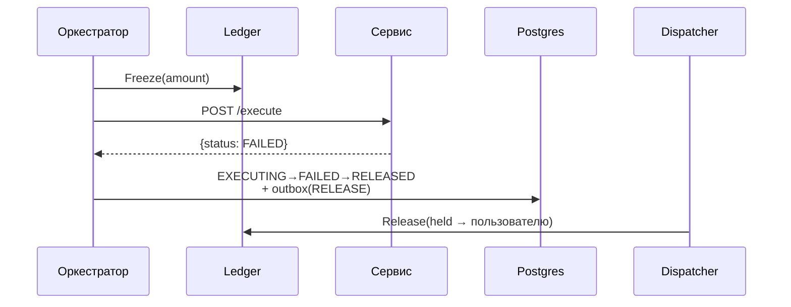
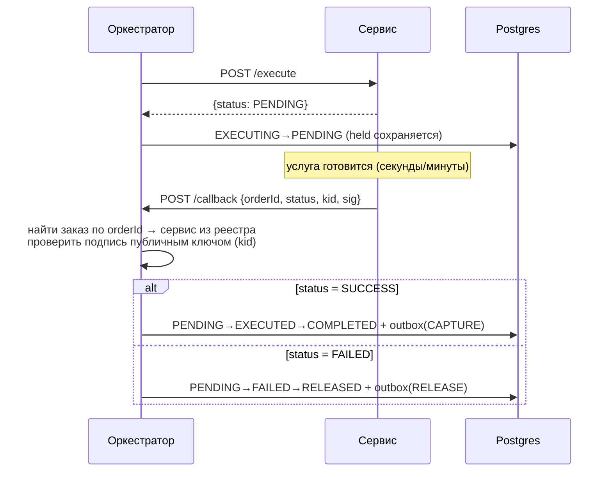
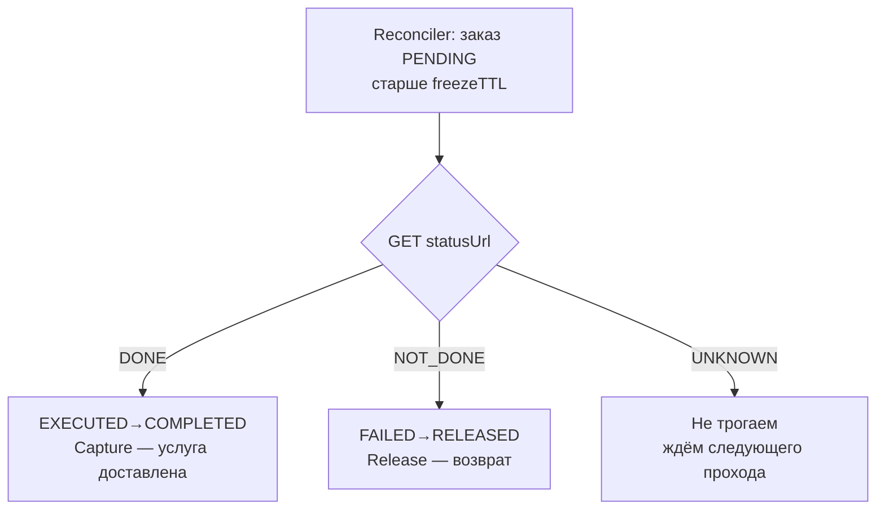

# Service Constructor

Open-source platform for embedding mini-apps and a payment saga into any
fintech wallet that handles money. Based on the
[Service Constructor white paper](./Service_Constructor_Whitepaper.pdf).

A registered **service** is an autonomous web app the wallet embeds via a
WebView; settlement runs through an orchestrator that freezes funds, executes
the service, and captures payment under a transactional saga.

This repository implements the **Service Registry** (CRUD over services) and the
**payment saga** (`POST /v1/services/pay`): a signed-quote + device-signed
consent flow that runs `freeze → execute → capture/release` under an explicit
order state machine. Both are exposed as gRPC with an HTTP/JSON gateway.

## Architecture

```
HTTP/JSON  ──►  grpc-gateway  ──►  gRPC server  ──►  Registry use case  ──►  Postgres
  (:8080)        (reverse proxy)     (:9090)          (validation, ids)        (pgx)
```

Layers (clean separation, transport- and storage-agnostic core):

| Path                              | Role                                              |
|-----------------------------------|---------------------------------------------------|
| `proto/`                          | gRPC + HTTP contract (source of truth)            |
| `gen/`                            | Generated stubs (`buf generate`)                  |
| `internal/domain`                 | Core entities and invariants (service, order, state machine) |
| `internal/service`               | Registry use case, `Repository` port              |
| `internal/saga`                   | Payment orchestrator, quote/consent verification, `Ledger`/`Executor` ports (+ mocks) |
| `internal/auth`                   | Pluggable `Authenticator`, gRPC interceptor       |
| `internal/repository/postgres`    | Postgres adapters (services, orders), migrations runner |
| `internal/server`                 | gRPC adapters, proto↔domain mapping               |
| `cmd/server`                      | Wiring: migrations, gRPC, gateway, shutdown       |

## Quick start

```bash
# 1. Start Postgres
make docker-up

# 2. Run the API (applies migrations on startup)
AUTH_MODE=none make run        # dev: no auth; or AUTH_JWT_SECRET=... make run

# 3. Run the admin UI (separate repo, separate terminal)
cd ../admin-ui && npm install && npm run dev   # http://localhost:5173
```

Defaults (override via env): `GRPC_ADDR=:9090`, `HTTP_ADDR=:8080`,
`DATABASE_URL=postgres://sc:sc@localhost:5432/service_constructor?sslmode=disable`,
`AUTH_MODE=jwt` (requires `AUTH_JWT_SECRET`).

## Authentication (pluggable)

Auth is a replaceable boundary on **both** ends so an integrator can wire in
their existing identity system without forking the app:

- **Backend** — implement `auth.Authenticator` (`internal/auth`) and pass it to
  the gRPC interceptor. Built-ins: `jwt` (HMAC JWT, reads `Authorization:
  Bearer`) and `none` (dev only, accepts everything). Selected via `AUTH_MODE`;
  swap `buildAuthenticator` in `cmd/server/main.go` for a custom one.
- **Frontend** — the admin UI lives in the separate `admin-ui` repo. Implement
  the `TokenProvider` interface (`src/auth/types.ts`) and change the one export
  in `src/auth/index.ts`. The default keeps a token in localStorage; swap it to
  source the token from an SSO cookie, OAuth flow, etc.

The admin API requires the `admin` role; the interceptor returns `401` when
unauthenticated and `403` without the role.

**Ownership (multi-tenant).** Each service is owned by the account that created
it (`owner_id` = the token `sub`). A regular `admin` only sees and edits their
own services; the `super_admin` role sees and edits all of them. Scoping is
enforced in both the use-case layer and the SQL (defense in depth), so a
cross-owner read/update/delete returns `404`.

## Admin UI

The admin console lives in its **own repository** (`../admin-ui`) — a React +
Vite + TypeScript SPA to list, create, edit and delete services, plus
generate/rotate service keys. Key generation runs on the backend (Ed25519 or
EC P-256); the **private key PEM is returned once** and never stored — the UI
shows a copy/download dialog. In dev, Vite proxies `/v1` to the gateway on
`:8080`; in prod, co-host the built `dist/` behind the API or set
`VITE_API_BASE`.

## REST API (via gateway)

| Method & path                          | Purpose          |
|----------------------------------------|------------------|
| `POST   /v1/admin/services`               | Create a service          |
| `GET    /v1/admin/services/{id}`          | Get a service             |
| `GET    /v1/admin/services`               | List (paginated)          |
| `PATCH  /v1/admin/services/{id}`          | Partial update            |
| `DELETE /v1/admin/services/{id}`          | Delete                    |
| `POST   /v1/admin/services/{id}/keys`     | Generate a key pair       |
| `POST   /v1/admin/services/{id}/rotate-key` | Rotate (new key + retire) |

List supports `pageSize`, `pageToken` (keyset cursor) and `status` filter.
`PATCH` uses field-mask semantics: only fields present in the JSON body change.

Example:

```bash
curl -X POST localhost:8080/v1/admin/services -H 'Content-Type: application/json' -d '{
  "name": "eSIM Provider",
  "origins": ["https://esim.example.com"],
  "executeUrl": "https://esim.example.com/execute",
  "statusUrl": "https://esim.example.com/status",
  "receivingWallets": [{"currencyId": "1", "walletId": "wlt_usdt_01"}],
  "fee": {"percent": "1.5"},
  "status": "SERVICE_STATUS_ACTIVE"
}'
```

## Payment saga

`POST /v1/services/pay` runs the saga over a **signed quote** + **device-signed
consent** (white paper section 7). The platform never lets a service debit funds
on its own: the service signs the quote with its private key (verified against
the registry public key by `kid`), and the user approves it on a trusted screen,
producing a device signature over `hash(quote) + wallet + nonce`.

Order state machine (white paper section 8):

```
CREATED → FROZEN → EXECUTING → EXECUTED → COMPLETED      (happy path)
                       ↓ PENDING (async, awaits webhook)
                       ↓ FAILED → RELEASED                (compensation)
```

Invariant: funds are moved to **held** (Ledger.freeze) *before* execute, so a
confirmed service is guaranteed to settle. On failure the held amount is
**released** back. The handler is **idempotent on the quote nonce**.

**Transactional outbox.** Capture and release are not applied to the ledger
inline. Instead the order transition (`→ COMPLETED` / `→ RELEASED`) and an
`outbox` row are written in **one DB transaction**, so they commit atomically. A
background **dispatcher** then reads undispatched rows and applies the ledger op
idempotently (ledger ops are idempotent by orderId), retrying on failure. This
closes the "capture happened but order not marked" gap (white paper §11): a
crash between marking the order and touching the ledger leaves a durable outbox
row that is simply re-applied.

**Audit trail.** Every accepted edge of the saga state machine is written to an
**append-only** `order_transitions` table (`from_state → to_state` with a machine
`reason` tag and a per-order `seq`), in the **same transaction** as the order
`UPDATE` — and, for capture/release, alongside the `outbox` row. Rows are only
ever inserted, so the history can never diverge from the order's current state
and gives a tamper-evident record of exactly how each order reached its terminal
state (white paper §8). Read it via `OrderStore.ListTransitions(orderId)`.

The `Ledger` (freeze/capture/release) and `Executor` (provider executeUrl) are
**ports**. The Ledger has a real gRPC implementation (`LEDGER_MODE=grpc`,
`LEDGER_ADDR=host:port`) that settles against the standalone
[ledger](../ledger) double-entry service — freeze debits available/credits held,
capture pays the service (net) and platform (fee), release compensates; a
wallet with no funds makes freeze fail and the order is `REJECTED`. It also ships
an in-memory mock (`LEDGER_MODE=mock`, the default). The Executor has a real HTTP
implementation (`EXECUTOR_MODE=http`) that POSTs to each service's `executeUrl`
with a timeout, bounded idempotent retries (backoff), and a per-service circuit
breaker — and a mock for local runs (`EXECUTOR_MODE=mock`, the default). A
`DeviceKeyResolver` supplies device public keys (used only when
`CONSENT_MODE=device`; `CONSENT_MODE=none` trusts the authenticated session).

See [`example-service`](../example-service) for a runnable reference service the
HTTP executor calls end-to-end.

| Method & path                                  | Purpose                       |
|------------------------------------------------|-------------------------------|
| `POST /v1/services/pay`                        | Run the saga (auth: user)     |
| `GET  /v1/services/{serviceId}/orders/{orderId}` | Order state                 |
| `POST /v1/services/callback`                   | Provider webhook (auth: signature) |

**Async execution.** A slow provider returns `PENDING`; the order parks until
the provider posts a signed callback to `/v1/services/callback` (verified
against the service key, idempotent by orderId): `SUCCESS` captures, `FAILED`
releases. A background **reconciler** scans orders stuck past their freeze TTL
and finalizes them — but before any release it queries the service's `statusUrl`
(**query-before-compensate**, white paper section 11.2): `DONE` captures,
`NOT_DONE` releases, `UNKNOWN` is left untouched, so a lost response never
triggers a blind refund of a delivered service.

## Как работает сага (подробно)

Раздел на русском с диаграммами — детальный разбор платёжной саги ядра: из
каких компонентов состоит, какие бывают состояния заказа, как деньги
замораживаются и списываются, и как система восстанавливается после сбоев.

### Зачем нужна сага

Платёж за услугу — это **распределённая транзакция** через несколько систем:
кошелёк пользователя (деньги), внешний сервис (доставка услуги) и платформа
(комиссия). Обычной ACID-транзакции тут недостаточно — сервис может ответить
через секунды, минуты или вообще не ответить. Паттерн **сага** решает это так:
каждый шаг имеет **компенсирующее действие**, и если шаг проваливается, ранее
сделанное откатывается. Ключевой инвариант: **деньги замораживаются до вызова
сервиса**, поэтому подтверждённая услуга гарантированно оплачивается, а
проваленная — гарантированно возвращает средства.

### Участники



| Компонент | Файл | Роль |
|---|---|---|
| **Оркестратор** | `internal/saga/orchestrator.go` | Ведёт заказ по состояниям, проверяет подписи, вызывает Ledger и Executor |
| **Ledger (порт)** | `internal/saga/ports.go` | `Freeze` / `Capture` / `Release` — двойная запись, идемпотентна по orderId |
| **Executor (порт)** | `internal/saga/httpexecutor.go` | POST на `executeUrl` сервиса: таймаут, ретраи с backoff, circuit breaker |
| **Dispatcher** | `internal/saga/dispatcher.go` | Фоновая обработка outbox — применяет capture/release к Ledger (at-least-once) |
| **Reconciler** | `internal/saga/reconciler.go` | Дочищает «застрявшие» заказы, опрашивая `statusUrl` перед компенсацией |
| **Проверка подписей** | `internal/saga/verify.go`, `callback.go` | Ed25519 / ECDSA-P256 подписи котировки, согласия, колбэка |

### Машина состояний заказа

Все допустимые переходы заданы в `internal/domain/order.go`. Терминальные
состояния (дальше переходов нет): **COMPLETED**, **RELEASED**, **FAILED**,
**REJECTED**.



Смысл ключевых состояний:

| Состояние | Что значит | Деньги |
|---|---|---|
| `CREATED` | Заказ создан, подпись котировки/согласия проверена | — |
| `FROZEN` | Ledger.Freeze прошёл — сумма в **held** | заморожены |
| `EXECUTING` | Идёт вызов `executeUrl` сервиса | заморожены |
| `PENDING` | Сервис ответил async — ждём webhook или reconciler | заморожены |
| `EXECUTED` | Услуга доставлена, осталось списать | заморожены |
| `COMPLETED` | Capture прошёл: сервис получил net, платформа — комиссию | **списаны** |
| `FAILED` | Провал — нужна компенсация | заморожены |
| `RELEASED` | Release прошёл: held вернулся пользователю | **возвращены** |
| `REJECTED` | Отказ до заморозки (freeze не прошёл) | не трогались |

### Синхронный успешный платёж (happy path)



Обрати внимание: переход в `COMPLETED` и строка `outbox` пишутся в **одной
транзакции БД**. Само же движение денег (Capture) делает **Dispatcher** позже,
идемпотентно. Это и есть паттерн **transactional outbox**.

### Синхронный провал → компенсация (возврат)



### Асинхронный платёж через webhook

Медленный сервис отвечает `PENDING`, заказ паркуется. Позже сервис сам
присылает **подписанный** колбэк на `POST /v1/services/callback`.



**Как ядро доверяет вебхуку.** Не по IP/адресу, а **криптографически**: колбэк
подписан приватным ключом сервиса, а ядро находит заказ по `orderId`, берёт
`serviceId` заказа, достаёт из реестра публичный ключ по `kid` и проверяет
Ed25519-подпись (`callback.go` → `VerifyCallbackSignature`). Поэтому подделать
чужой колбэк нельзя — подпись сверяется именно с сервисом, зарегистрированным
для этого заказа. Повторный колбэк на терминальный заказ — no-op (идемпотентно).

### Восстановление: Reconciler (query-before-compensate)

Если webhook потерялся или сервис завис, заказ остаётся в `PENDING`.
**Reconciler** периодически (по умолчанию раз в 30с) находит заказы, застрявшие
дольше `freezeTTL` (по умолчанию 2 мин), и финализирует их — но **никогда не
возвращает деньги вслепую**. Сначала он опрашивает `statusUrl` сервиса:



Почему это важно: потерянный ответ сервиса **не должен** приводить к слепому
возврату уже доставленной услуги. Правило «сначала спроси статус, потом
компенсируй» (white paper §11.2) исключает такую потерю денег. Отдельно
reconciler повторяет `Capture` для заказов, застрявших в `EXECUTED` (списание
не применилось) — деньги заморожены, расчёт гарантирован.

### Устойчивость Executor: ретраи и circuit breaker

`httpexecutor.go` вызывает `executeUrl` с защитой:

- **Ретраи** — до `maxRetries` (по умолчанию 2) дополнительных попыток с
  экспоненциальным backoff (база 200мс). Ретраятся: сетевые ошибки, таймаут,
  `5xx`, `429`. Не ретраятся: `4xx` (кроме 429).
- **Circuit breaker** — на каждый сервис. После N подряд ошибок (порог 5)
  «размыкается» и на время (30с) быстро отклоняет запросы, не долбя упавший
  сервис. Если ретраи исчерпаны — заказ компенсируется (возврат).

### Transactional outbox и Dispatcher

Движения по Ledger (Capture/Release) **не применяются inline**. Вместо этого
переход заказа и строка `outbox` пишутся в **одной DB-транзакции** — атомарно.
Фоновый **Dispatcher** (раз в ~1с) читает непроведённые строки и применяет
операцию к Ledger **идемпотентно** (Ledger идемпотентен по orderId), повторяя
при сбое (at-least-once).

Это закрывает щель «capture произошёл, но заказ не помечен» и обратную: краш
между пометкой заказа и обращением к Ledger оставляет durable-строку в outbox,
которую просто применят заново.

### Аудит: append-only история переходов

Каждый принятый переход саги пишется в **append-only** таблицу
`order_transitions` (`from_state → to_state`, машинный `reason`, per-order `seq`)
в **той же транзакции**, что и `UPDATE` заказа. Строки только вставляются,
поэтому история никогда не разойдётся с текущим состоянием и даёт защищённый от
подделки след, как именно заказ пришёл к терминалу. Чтение —
`OrderStore.ListTransitions(orderId)`. Примеры `reason`-тегов: `freeze_ok`,
`execute_success`, `execute_pending`, `webhook_done`, `capture`, `release`,
`reconcile_notdone`.

### Полная карта исходов саги

| Исход | Путь по состояниям | Ledger | Терминал |
|---|---|---|---|
| Синхронный успех | CREATED→FROZEN→EXECUTING→EXECUTED→COMPLETED | Freeze + Capture | COMPLETED |
| Синхронный провал | …→EXECUTING→FAILED→RELEASED | Freeze + Release | RELEASED |
| Async webhook успех | …→PENDING→EXECUTED→COMPLETED | Freeze + Capture | COMPLETED |
| Async webhook провал | …→PENDING→FAILED→RELEASED | Freeze + Release | RELEASED |
| Ретраи → успех | executor ретраит 5xx, затем SUCCESS | Freeze + Capture | COMPLETED |
| Ретраи исчерпаны | executor сдался → компенсация | Freeze + Release | RELEASED |
| Reconciler DONE | PENDING→(status=DONE)→COMPLETED | Freeze + Capture | COMPLETED |
| Reconciler NOT_DONE | PENDING→(status=NOT_DONE)→RELEASED | Freeze + Release | RELEASED |
| Reconciler UNKNOWN | остаётся PENDING (без слепого возврата) | held | (PENDING) |
| Отказ до заморозки | CREATED→REJECTED (плохая подпись / нет средств) | — | REJECTED |

Эти же исходы — рабочие сценарии в референс-мини-аппах
([example-image-miniapp](../example-image-miniapp),
[example-coffee-miniapp](../example-coffee-miniapp)): выбор сценария едет в
`metadata` котировки, сервис отрабатывает нужную ветку.

### Параметры конфигурации саги

| Env / настройка | По умолчанию | Влияние |
|---|---|---|
| `EXECUTOR_MODE` | `mock` | `http` — реальные вызовы `executeUrl`; `mock` — канонический ответ |
| `LEDGER_MODE` | `mock` | `grpc` — реальный ledger-сервис; `mock` — in-memory |
| `CONSENT_MODE` | `device` | `device` — требуется подпись устройства; `none` — доверяем сессии |
| `freezeTTL` | 2 мин | после этого reconciler считает заказ застрявшим |
| reconciler interval | 30 с | как часто сканируются застрявшие заказы |
| dispatcher interval | 1 с | как часто применяется outbox |
| executor maxRetries | 2 | доп. попытки вызова `executeUrl` |
| circuit breaker | 5 ошибок / 30 с | порог размыкания и кулдаун на сервис |

## Development

```bash
make tools      # install protoc-gen-go, -go-grpc, -grpc-gateway
make generate   # regenerate gen/ from proto/
make test       # run unit tests
make build      # build ./bin/server
```

Code generation uses [buf](https://buf.build) with googleapis annotation protos
vendored under `third_party/` (no Buf Schema Registry auth required).

## Roadmap

- [x] Service Registry CRUD (gRPC + HTTP gateway, Postgres)
- [x] Pluggable admin auth (backend `Authenticator` + frontend `TokenProvider`)
- [x] Service key generation/rotation (Ed25519 / EC P-256)
- [x] Admin UI (React + Vite + TS)
- [x] Signed quote + device-signed consent verification
- [x] Payment saga: `freeze → execute → capture` with compensation (order state machine)
- [x] Async webhook callback (`/v1/services/callback`, signed) to finalize PENDING orders
- [x] Reconciler with query-before-compensate (polls service `statusUrl`)
- [x] Real HTTP Executor (timeout, idempotent retries with backoff, circuit breaker)
- [x] Transactional outbox + dispatcher (capture/release applied idempotently)
- [x] Append-only order transition history (audit trail of the saga)
- [ ] Real Ledger adapter (mock ships today)
- [ ] Server SDK for service integrators
